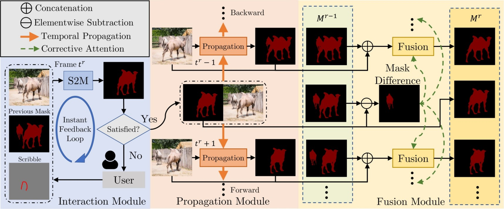

# Modular Interactive Video Object Segmentation: Interaction-to-Mask, Propagation and Difference-Aware Fusion (MiVOS)

[Ho Kei Cheng](https://hkchengrex.github.io/), Yu-Wing Tai, Chi-Keung Tang
CVPR 2021

[[Paper]]  ((Soon!)) [[Project Page]](https://hkchengrex.github.io/MiVOS/) [[Demo]](https://hkchengrex.github.io/MiVOS/video.html#partb)

  

Credit (left to right): DAVIS 2017, [Academy of Historical Fencing](https://youtu.be/966ulgwEcyc), [Modern History TV](https://youtu.be/e_D1ZQ7Hu0g)

We manage the project using three different repositories (which are actually in the paper title). This is the main repo, see also [Mask-Propagation](https://github.com/hkchengrex/Mask-Propagation) and [Scribble-to-Mask](https://github.com/hkchengrex/Scribble-to-Mask).

## Overall structure and capabilities

| | [MiVOS](https://github.com/hkchengrex/MiVOS) | [Mask-Propagation](https://github.com/hkchengrex/Mask-Propagation)| [Scribble-to-Mask](https://github.com/hkchengrex/Scribble-to-Mask)  |
| ------------- |:-------------:|:-----:|:-----:|
| DAVIS/YouTube semi-supervised evaluation | :x: | :heavy_check_mark: | :x: |
| DAVIS interactive evaluation | :heavy_check_mark: | :x: | :x: |
| User interaction GUI tool | :heavy_check_mark: | :x: | :x: |
| Dense Correspondences | :x: | :heavy_check_mark: | :x: |
| Train propagation module | :x: | :heavy_check_mark: | :x: |
| Train S2M (interaction) module | :x: | :x: | :heavy_check_mark: |
| Train fusion module | :heavy_check_mark: | :x: | :x: |
| Generate more synthetic data | :heavy_check_mark: | :x: | :x: |

## Framework



## Requirements

We used these packages/versions in the development of this project. It is likely that higher versions of the same package will also work. This is not an exhaustive list -- other common python packages (e.g. pillow) are expected and not listed.

- PyTorch `1.7.1`
- OpenCV `4.2.0`
- progressbar (`pip install progressbar2`)
- davis-interactive (<https://github.com/albertomontesg/davis-interactive>)
- networkx `2.4` for DAVIS
- gitpython for training (`pip install gitpython`)
- gdown for downloading pretrained models (`pip install gdown`)

## Quick start

1. `python download_model.py` to get all the required models.
2. `python interactive_gui.py --video <path to video>` or `python interactive_gui.py --images <path to a folder of images>`. A video has been prepared for you at `examples/example.mp4`.
3. If you need to label more than one object, additionally specify `--num_objects <number_of_objects>`
4. There are instructions in the GUI. You can also watch the [demo videos](https://hkchengrex.github.io/MiVOS/video.html#partb) for some ideas.

## Main Results

### [DAVIS/YouTube semi-supervised results](https://github.com/hkchengrex/Mask-Propagation/#main-results)

### DAVIS Interactive Track

All results are generated using the unmodified [official DAVIS interactive bot](https://github.com/albertomontesg/davis-interactive) without saving masks (`--save_mask` not specified) and with an RTX 2080Ti. We follow the [official protocol](https://interactive.davischallenge.org/user_guide/usage/).

Precomputed result, with the json summary: [[Google Drive]](https://drive.google.com/file/d/1WMPCXs5FNAF3dE2Ubg_SYegZaOd1cATM/view?usp=sharing) [[OneDrive]](https://hkustconnect-my.sharepoint.com/:u:/g/personal/hkchengad_connect_ust_hk/EXLxK6VPO7BDodHlos6TDS0BZ7J38pDIhmjit9W5utLXmQ?e=8e06sE)

`eval_interactive_davis.py`

| Model | AUC-J&F | J&F @ 60s |
| --- |:--:|:---:|
| Baseline | 86.0 | 86.6 |
| (+) Top-k | 87.2 | 87.8 |
| (+) BL30K pretraining | 87.4 | 88.0 |
| (+) Learnable fusion | 87.6 | 88.2 |
| (+) Difference-aware fusion (full model) | 87.9 | 88.5 |

## Pretrained models

`python download_model.py` should get you all the models that you need. (`pip install gdown` required.)

[[OneDrive Mirror]](https://hkustconnect-my.sharepoint.com/:f:/g/personal/hkchengad_connect_ust_hk/EjHifAlvYUFPlEG2qBr-GGQBb1XyzxUvizJiQKBf8te2Cw?e=a6mxKz)

## Training

### Data preparation

Datasets should be arranged as the following layout. You can use `download_datasets.py` (same as the one Mask-Propagation) to get the DAVIS dataset and manually download and extract fusion_data ([[OneDrive]](https://hkustconnect-my.sharepoint.com/:u:/g/personal/hkchengad_connect_ust_hk/ESGj7FihDUpNjpygP8u1NGkBc-9YFSMFCDDpxKA87aTJ4w?e=SPXheO)) and [BL30K](#bl30k).

```bash
├── BL30K
├── DAVIS
│   └── 2017
│       ├── test-dev
│       │   ├── Annotations
│       │   └── ...
│       └── trainval
│           ├── Annotations
│           └── ...
├── fusion_data
└── MiVOS
```

### BL30K

BL30K is a synthetic dataset rendered using Blender with ShapeNet's data. We break the dataset into six segments, each with approximately 5K videos.
The videos are organized in a similar format as DAVIS and YouTubeVOS, so dataloaders for those datasets can be used directly. Each video is 160 frames long, and each frame has a resolution of 768*512. There are 3-5 objects per video, and each object has a random smooth trajectory -- we tried to optimize the trajectories greedily to minimize object intersection (not guaranteed), with occlusions still possible (happen a lot in reality). See `generation/blender/generate_yaml.py` for details.

We noted that using probably half of the data is sufficient to reach full performance (although we still used all), but using less than one-sixth (5K) is insufficient.

#### Download

You can either use the automatic script `download_bl30k.py` or download it manually below. Note that each segment is about 115GB in size -- 700GB in total. You are going to need ~1TB of free disk space to run the script (including extraction buffer).

Google Drive is much faster in my experience. Your mileage might vary.

Manual download: [[Google Drive]](https://drive.google.com/drive/folders/1KxriFZM8Y_-KbiA3D0PaMv6LQaatKFH-?usp=sharing) [[OneDrive]](https://uillinoisedu-my.sharepoint.com/:f:/g/personal/hokeikc2_illinois_edu/ElEqJXQqaqZAqG8QROa0VesBAw4FiOl5wleP2iq_KXDPyw?e=eKMSbx)

#### Generation

1. Download [ShapeNet](https://www.shapenet.org/).
2. Install [Blender](https://www.blender.org/). (We used 2.82)
3. Download a bunch of background and texture images. We used [this repo](https://github.com/hardikvasa/google-images-download) (we specified "non-commercial reuse" in the script) and the list of keywords are provided in generation/blender/*.json.
4. Generate a list of configuration files (generation/blender/generate_yaml.py).
5. Run rendering on the configurations.
(Not documented in detail, ask if you have a question)

### Fusion data

We use the propagation module to run through some data and obtain real outputs to train the fusion module. See the script `generate_fusion.py`.

Or you can download pre-generated fusion data:

### Training commands

These commands are to train the fusion module only.

`CUDA_VISIBLE_DEVICES=[a,b] OMP_NUM_THREADS=4 python -m torch.distributed.launch --master_port [cccc] --nproc_per_node=2 train.py --id [defg] --stage [h]`

We implemented training with Distributed Data Parallel (DDP) with two 11GB GPUs. Replace `a, b` with the GPU ids, `cccc` with an unused port number,  `defg` with a unique experiment identifier, and `h` with the training stage (0/1).

The model is trained progressively with different stages (0: BL30K; 1: DAVIS). After each stage finishes, we start the next stage by loading the trained weight. A pretrained propagation model is required to train the fusion module.

One concrete example is:

Pre-training on the BL30K dataset: `CUDA_VISIBLE_DEVICES=0,1 OMP_NUM_THREADS=4 python -m torch.distributed.launch --master_port 7550 --nproc_per_node=2 train.py --load_prop saves/propagation_model.pth --stage 0 --id retrain_s0`

Main training: `CUDA_VISIBLE_DEVICES=0,1 OMP_NUM_THREADS=4 python -m torch.distributed.launch --master_port 7550 --nproc_per_node=2 train.py --load_prop saves/propagation_model.pth --stage 1 --id retrain_s012 --load_network [path_to_trained_s0.pth]`

## Credit

f-BRS: <https://github.com/saic-vul/fbrs_interactive_segmentation>

ivs-demo: <https://github.com/seoungwugoh/ivs-demo>

deeplab: <https://github.com/VainF/DeepLabV3Plus-Pytorch>

STM: <https://github.com/seoungwugoh/STM>

BlenderProc: <https://github.com/DLR-RM/BlenderProc>

## Citation

Please cite our paper if you find this repo useful!

```bibtex
@inproceedings{MiVOS_2021,
  title={Modular Interactive Video Object Segmentation: Interaction-to-Mask, Propagation and Difference-Aware Fusion},
  author={Cheng, Ho Kei and Tai, Yu-Wing and Tang, Chi-Keung},
  booktitle={CVPR},
  year={2021}
}
```

Contact: <hkchengrex@gmail.com>
